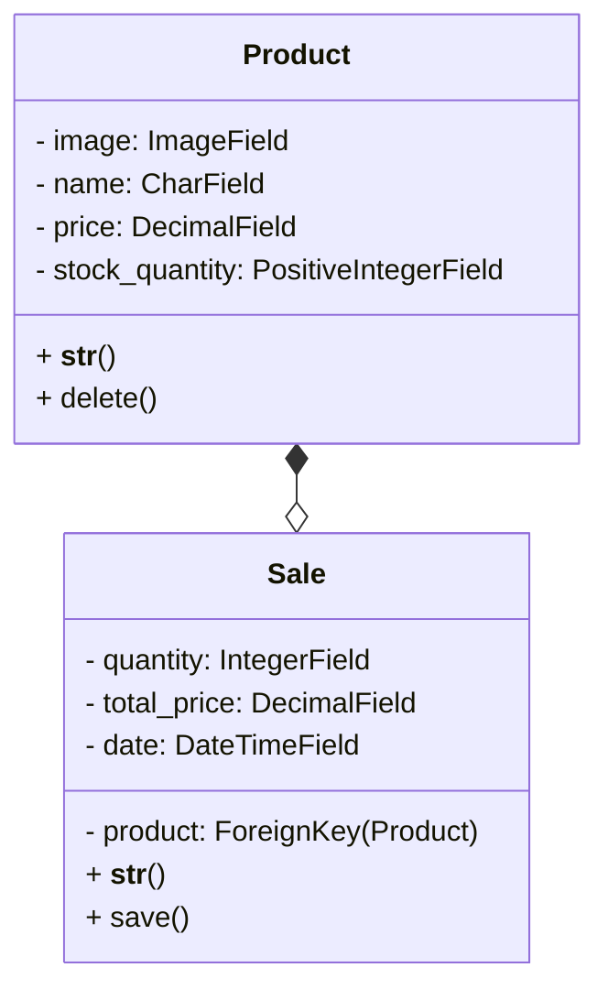

# Django CRM

Este é um projeto de um mecanismo de CRM desenvolvido em Django para gerenciar produtos e estoque de uma empresa. Com esse sistema, é possível cadastrar, remover e editar produtos, definir a quantidade em estoque e registrar vendas, atualizando automaticamente o estoque e o faturamento total da empresa.

## Instalação

1. Clone o repositório

```bash
git clone https://github.com/ruangustavo/django-crm.git
```

2. Crie um ambiente virtual

```bash
python -m venv venv
venv\Scripts\activate
```

3. Instale as dependências

```bash
pip install -r requirements.txt
```

4. Execute as migrações

```bash
python manage.py migrate
```

5. Crie um usuário administrador

```bash
python manage.py createsuperuser
```

6. Execute o servidor

```bash
python manage.py runserver
```

7. Acesse o sistema em: `http://localhost:8000`

## Funcionalidades

- Cadastro de produtos com informações como nome, descrição, preço e quantidade em estoque
- Edição e remoção de produtos
- Registro de vendas com atualização automática do estoque e do faturamento total da empresa
- Página de relatório com informações de produtos em estoque e faturamento total

## Diagrama de classes


